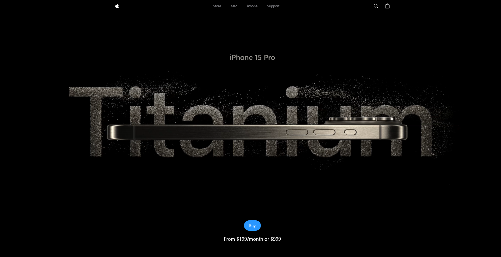

This repository contains the source code for a frontend site resembling the **iPhone 15 Pro** landing page. The site features *dynamic animations* powered by **GSAP** and an *interactive 3D model* of the iPhone created using **Three.JS**, and *error tracking* and *performance monitoring* through **Sentry**.


### Technologies Used:

<div>
    
    
    
    
    
    
</div>

## Installation

1. **Clone the repository**:
   ```bash
   git clone https://github.com/arindal1/iPhone15-pro.git
   cd iPhone15-pro
   ```

2. **Install dependencies**:
   ```bash
   npm install
   ```

## Usage

To start the development server and view the site locally:

```bash
npm run dev
```

## Contact

For more information, feel free to connect with me:

- [GitHub](https://github.com/arindal1)
- [LinkedIn](https://www.linkedin.com/in/arindalchar)
- [Twitter](https://twitter.com/arindal_17)

## License

This project is licensed under the MIT License. See the [LICENSE](LICENSE) file for more details.

## Keep Coding 🚀